# Presentation script: "Dataset Generation" (IABR-v2)

**How to use this file.** Each slide below has: the image to show (in `slides/`), what to point at, and the words to say in simple English.
Words in *italics* are stage directions. Total time: about 12 to 15 minutes for 16 image slides + 3 text slides.

**One-line summary you can open with:**
> "We do not have a fixed training dataset. We have a *simulator* that makes a new random scene every time. Each scene gives the network one input, the measurement Y, and two answers, a heatmap of path directions and a vector of hardware errors."

---

## Slide 0 - Title / big picture (no image, 30 seconds)

**Show:** title "Dataset generation for IABR-Net v2".

**Say:**
- "The task is joint AoA and AoD estimation for a millimetre-wave MIMO link. Both sides have a 16-antenna array."
- "The receiver sends known probing beams and measures a 16 by 16 matrix Y. From Y, the network must find the arrival angle (AoA) and departure angle (AoD) of every path."
- "Our data is not downloaded. It is generated by a physical simulator. Training data is an endless random stream. Test data is a set of frozen files."
- "I will now walk through the generation from the first random number to the final label."

---

## Slide 1 - The 8-step flow  (`S01_flow_8_steps.png`)

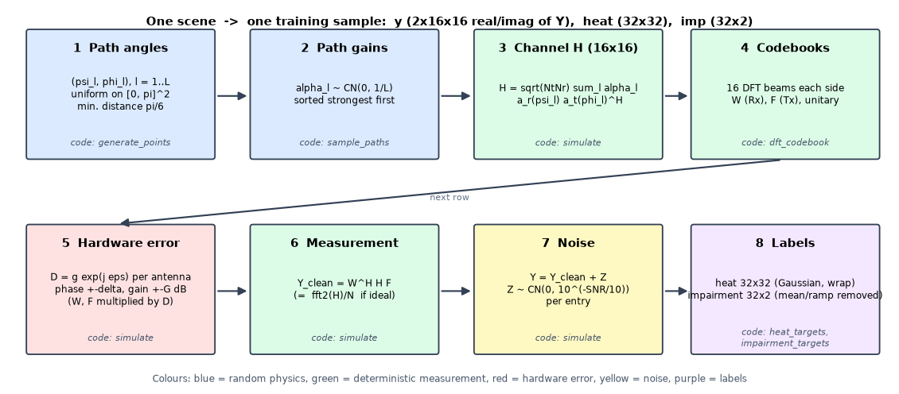

**Point at:** the 8 boxes, left to right, top row then bottom row. Colours: blue = random physics, green = fixed maths, red = hardware error, yellow = noise, purple = labels.

**Say:**
- "This is the whole pipeline. One scene goes through eight steps."
- "Step 1 and 2 are random: we pick the path directions and the path strengths."
- "Step 3 builds the channel matrix H from those paths."
- "Step 4 is the set of beams used for measuring, the DFT codebooks. Step 5 adds hardware errors to those beams. Step 6 measures: Y equals W-Hermitian times H times F."
- "Step 7 adds noise at the chosen SNR."
- "Step 8 makes the answers: a 32 by 32 heatmap and an impairment vector."
- "The network only ever sees the result of step 7. Steps 1 to 5 are hidden from it. Step 8 is what it must predict."

---

## Slide 2 - Training vs testing pipeline  (`S02_train_vs_test_pipeline.png`)

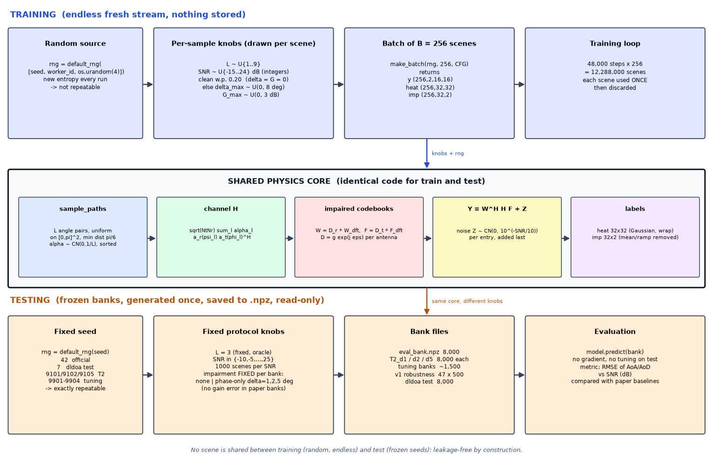

**Point at:** the blue top lane, the grey middle box, the orange bottom lane.

**Say:**
- "The middle box, the physics core, is the same code for training and testing. Only the *knobs* and the *random seeds* are different."
- **Training (top):**
  - "Every batch is created on the fly. The random generator is seeded with the seed, the worker id and 4 random bytes from the operating system, so each run is different."
  - "For each scene we draw: number of paths L from 1 to 9, SNR from minus 15 to 24 dB (whole numbers), and with probability 20 percent the hardware is perfect. Otherwise the phase-error limit is drawn from 0 to 8 degrees and the gain-error limit from 0 to 3 dB."
  - "A batch is 256 scenes. Training runs 48,000 steps. That is 12.29 million scenes. Each scene is used once and thrown away. Nothing is stored."
- **Testing (bottom):**
  - "Test sets are generated once with a fixed seed and saved to files. So anyone can reproduce them exactly."
  - "In the test sets L is always 3, SNR goes from minus 10 to 25 in steps of 5 dB, with 1,000 scenes per SNR, so 8,000 scenes. The hardware error is fixed for each bank: none, or phase-only with 1, 2 or 5 degrees."
- "Training scenes and test scenes never overlap. Test seeds are fixed (42, 7, 9101, 9102, 9105). Training seeds come from the operating system."

---

## Slide 3 - Step 1: path angles  (`S03_path_angles.png`)

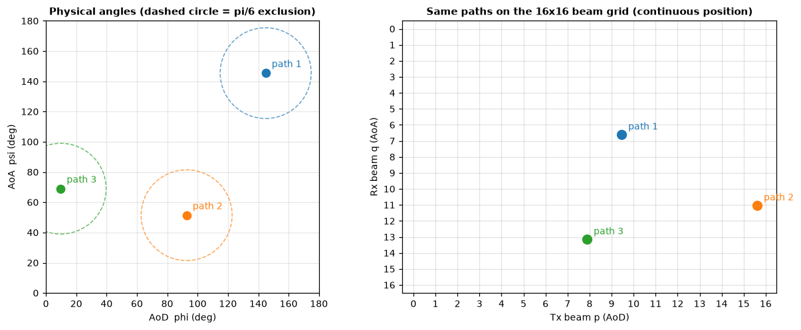

**Point at (left):** three dots and dashed circles. **Point at (right):** the same three paths on the 16 by 16 beam grid.

**Say:**
- "A path is one way the signal travels from transmitter to receiver. Each path has a departure angle phi (AoD) and an arrival angle psi (AoA)."
- "We draw the pairs uniformly on 0 to 180 degrees on both axes. This is the authors' rejection sampler: a new path is rejected if it is closer than pi over 6 (30 degrees) to an earlier one, measured as the ordinary distance in the (phi, psi) plane. The dashed circles show that exclusion zone."
- "The receiver does not see angles directly. It sees them through the beam grid. The position of a path on the grid depends on the *cosine* of the angle, not on the angle."
- "The formulas: row q equals 16 times (minus pi cos psi, wrapped into 0 to 2 pi) divided by 2 pi. Column p equals 16 times (pi cos phi, wrapped) divided by 2 pi. Rows are AoA, columns are AoD."
- "Important side effect: because of the cosine, paths near 0 or 180 degrees, called end-fire, get squeezed together. Later I will show numbers for that."

---

## Slide 4 - Steps 2 and 3: path gains and the channel H  (`S04_channel_H.png`)

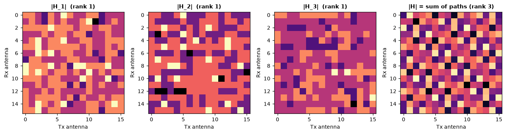

**Point at:** the three left panels (one path each, rank 1) and the right panel (sum, rank 3).

**Say:**
- "Step 2: every path gets a complex gain alpha, drawn from a complex Gaussian with variance 1 over L. So the total average power is 1. We sort the gains, strongest first."
- "Step 3: the channel matrix H is the sum over paths: square root of (Nt times Nr), times alpha, times the receive steering vector, times the conjugate transpose of the transmit steering vector. Here Nt and Nr are both 16, so the factor is 16."
- "The steering vector for angle theta is exp(minus j pi k cos theta) divided by root 16, for antenna k. It is a half-wavelength uniform line array."
- "Each single path is a rank-one matrix. Its magnitude is flat across the array. Only the phase slope carries the angle. The sum of three paths has rank 3. You can see three non-zero singular values in the notebook."

---

## Slide 5 - Step 4: the DFT codebooks  (`S05_codebooks.png`)

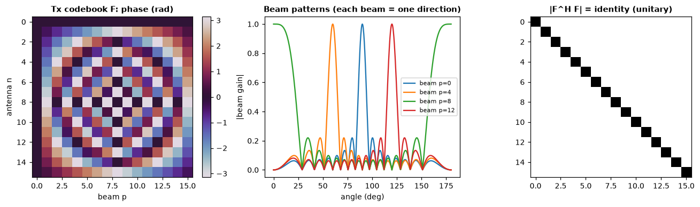

**Point at:** left = phase pattern of the transmit codebook, middle = beam patterns, right = identity matrix.

**Say:**
- "The receiver does not read H antenna by antenna. It uses 16 fixed beams on each side. These are DFT beams, equally spaced in cosine of angle."
- "F is the transmit codebook, W is the receive codebook. Each is a 16 by 16 matrix. Each column is one beam."
- "The middle plot shows that each beam points in one direction."
- "The right plot shows F-Hermitian times F is the identity. So the codebooks are unitary: no gain, no loss, no correlation between beams. This matters because it makes the noise white and the SNR easy to define."

---

## Slide 6 - Step 6 (ideal): the clean measurement Y  (`S06_clean_measurement_Y.png`)

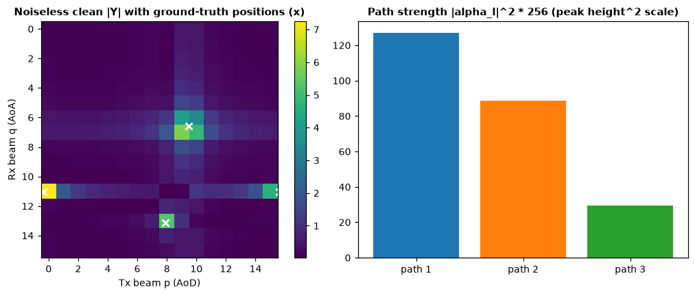

**Point at (left):** the bright spots and the white crosses (ground truth). **Point at (right):** bar heights = path strength.

**Say:**
- "The measurement is Y equals W-Hermitian times H times F. Y is a 16 by 16 complex matrix. Entry (q, p) is the response of receive beam q and transmit beam p."
- "With ideal hardware this is *exactly* a two-dimensional FFT of H divided by 16. We checked: the difference is about 10 to the power minus 14."
- "So every path shows up as a peak at its beam position. The white crosses are the true positions. A path that falls between two beams leaks into its neighbours, that is why the peak looks like a small cross."
- "Strong paths give tall peaks; weak paths give small ones. That is the right-hand chart."

---

## Slide 7 - Step 5: hardware errors per antenna  (`S07_per_antenna_errors.png`)

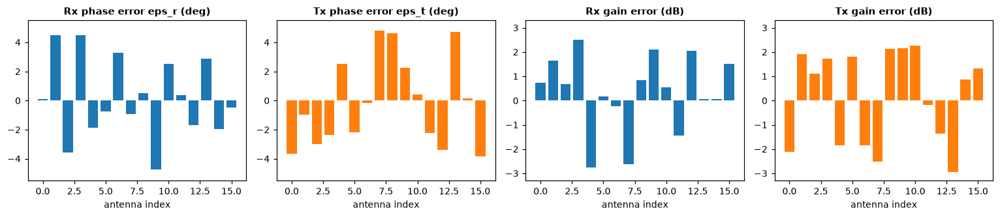

**Point at:** the four bar charts: receive phase, transmit phase, receive gain, transmit gain.

**Say:**
- "Real arrays are not perfect. Every antenna has a small phase error and a small gain error."
- "We model each antenna weight as multiplied by D equals g times e to the j epsilon. This is applied to both codebooks: W becomes D-receive times W, F becomes D-transmit times F."
- "The phase error epsilon is uniform between minus delta and plus delta degrees. The gain error is uniform in decibels between minus G and plus G."
- "In this demo scene the limits are the upper end of the training range (up to 8 degrees, 3 dB). Each of the 32 antennas (16 receive plus 16 transmit) has its own random error. The same error is used for all beams. A new error is drawn for every scene."
- *Be ready to say:* "The phase part follows the base paper. The gain part is our own extension. The paper models phase only."

---

## Slide 8 - Clean vs impaired measurement  (`S08_clean_vs_impaired.png`)

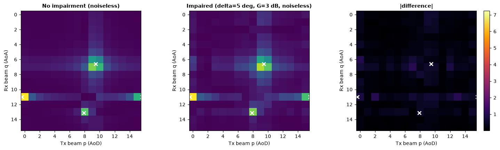

**Point at:** left = no impairment, middle = impaired, right = difference.

**Say:**
- "Same scene, same paths. Left: perfect hardware. Middle: with hardware errors switched on."
- "The peaks stay in the same place. But energy leaks along the row and column of each peak, and the peak heights change."
- "The right panel is the difference. In this example it is about 32 percent of the signal norm (ratio 0.316, or minus 10 dB)."
- "Small errors, like 1 or 2 degrees of phase, change Y much less, so the hard cases are the larger mixed ones. That is why the network has to learn to undo the impairment."

---

## Slide 9 - Step 7: adding noise  (`S09_noise_2x3.png`)

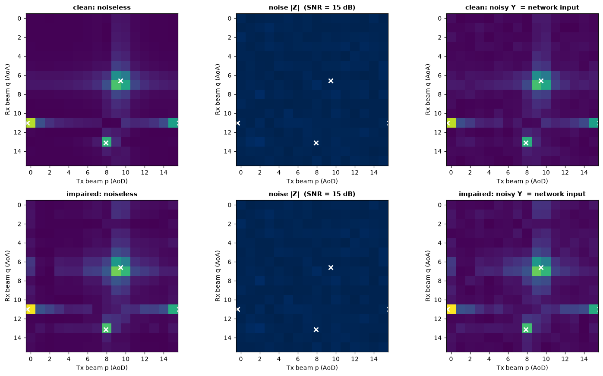

**Point at:** top row = clean hardware, bottom row = impaired hardware. Columns: noiseless, noise, noisy.

**Say:**
- "Noise is added last, after the receive beams. It is complex Gaussian, independent for every entry of Y. Its power is 10 to the power minus SNR over 10."
- "In code: each real and imaginary part has standard deviation square root of (10 to the minus SNR/10, divided by 2)."
- "Because the total path power is 1 and the codebooks are unitary, the average signal power per entry of Y is 1. So the nominal SNR is exactly a per-entry ratio. In this example I set 15 dB, and the realised value was 15.3 dB, because this one scene has a slightly different noise draw and its path power sums to 0.958 instead of 1."
- "Top and bottom rows show the same scene with and without hardware error, so you can compare the effect of the error directly."
- "The right column is the final network input."

---

## Slide 10 - Step 8a: heatmap ground truth  (`S10_heatmap_ground_truth.png`)

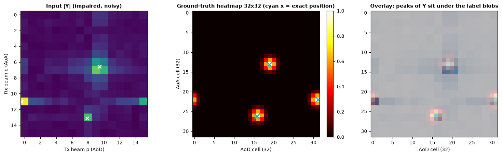

**Point at:** left = input Y, middle = 32x32 heatmap, right = overlay.

**Say:**
- "First answer the network must produce: a 32 by 32 heatmap. It is twice finer than the 16 by 16 measurement, so the network can place a path *between* two beams."
- "For every path we compute its exact position on the 32-grid, round to the nearest cell, and put a Gaussian blob there. Width is one cell. The peak value is exactly 1."
- "The distance is circular, wrap-around, because beam space repeats. In this example one path sits at the edge and its blob continues on the opposite side of the image."
- "If several paths overlap, we take the maximum, not the sum. So the heatmap stays between 0 and 1."
- "Rows are AoA, columns are AoD. The right panel shows that the peaks of Y sit right under the label blobs."

---

## Slide 11 - Step 8b: impairment ground truth  (`S11_impairment_ground_truth.png`)

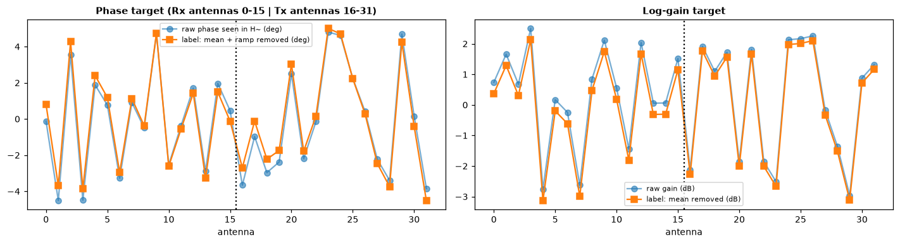

**Point at:** left = phase (deg), right = log-gain. Dotted line: receive antennas 0-15 on the left, transmit antennas 16-31 on the right. Blue line = raw, orange = label.

**Say:**
- "Second answer: the true hardware error of each of the 32 antennas. It is a 32 by 2 array: phase and log-gain."
- "Sign convention: because the measurement acts on H as conjugate of D-receive times H times D-transmit, the receive phase label is minus the receive error angle, and the transmit label is plus the transmit error angle."
- "We do *not* ask the network for parts that cannot be identified from data. For phase, we remove the mean and the linear ramp on each side. A linear phase ramp across an array looks exactly like a shift in the arrival angle, so it cannot be told apart from a real angle change. The mean phase is a common offset. For gain we remove the mean."
- "So the orange line is the raw blue line minus its mean and slope. We checked in the notebook that the mean and slope of the label are zero."

---

## Slide 12 - Same scene, different SNR and impairment  (`S12_snr_x_impairment_grid.png`)

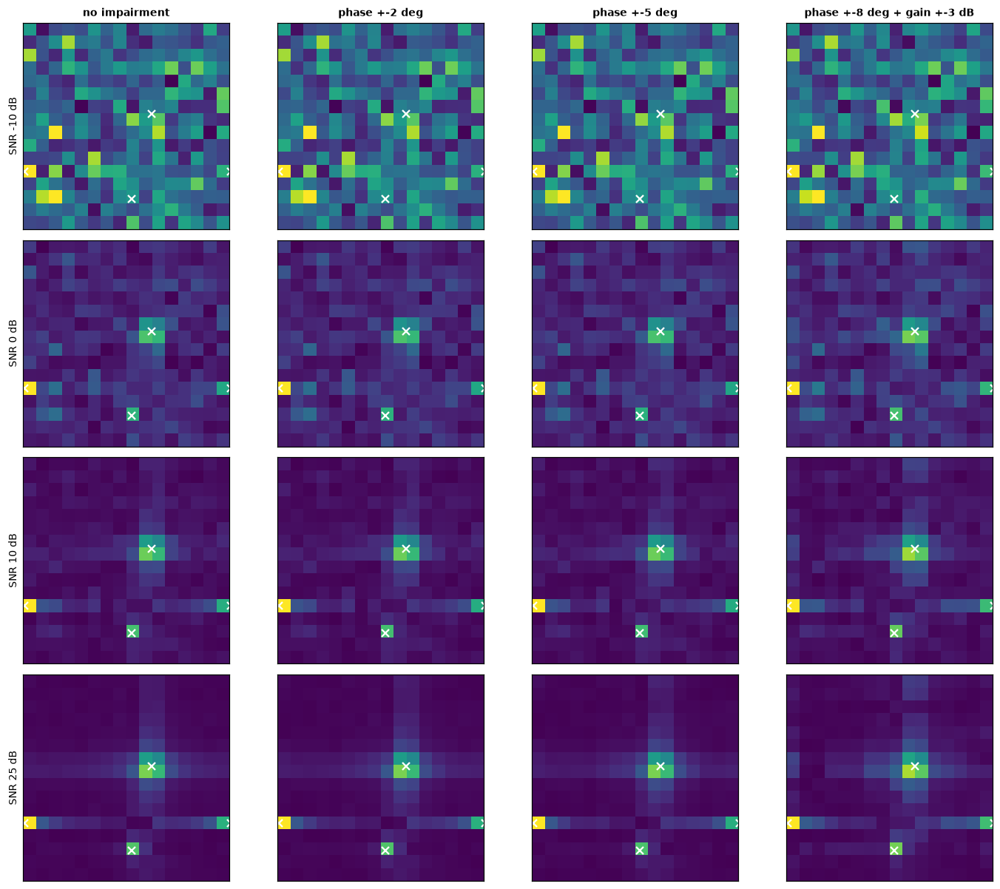

**Point at:** rows = SNR (minus 10, 0, 10, 25 dB), columns = none, 2, 5, 8 degrees plus 3 dB gain. White crosses = ground truth.

**Say:**
- "This is the key picture. The same scene is shown at different SNR and different impairment levels."
- "Going down (higher SNR), the paths come out of the noise. At minus 10 dB the peaks are almost invisible."
- "Going right (more impairment), the leakage around each peak grows. At 25 dB and the last column, the peaks are still in the right places but surrounded by strong leakage."
- "The network must cope with both problems at the same time: noise at low SNR and leakage at high SNR."

---

## Slide 13 - What the network actually sees  (`S13_network_input_channels.png`)

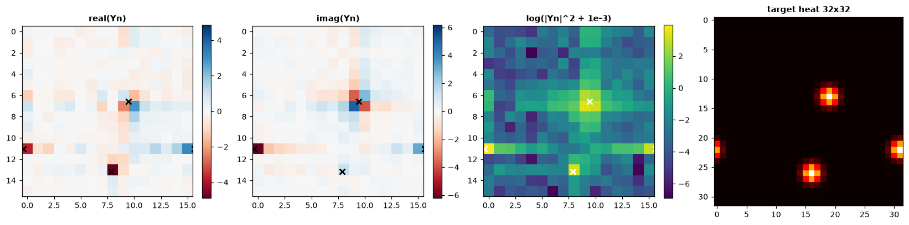

**Point at:** four panels: real part, imaginary part, log-magnitude, target heatmap.

**Say:**
- "This part is inside the network, not part of the stored data. The dataset stores Y as two planes: real and imaginary, shape 2 by 16 by 16."
- "In the network, Y is first divided by its RMS, so the scale does not depend on SNR. Then a third channel is added: log of (magnitude squared plus 0.001)."
- "The log channel is what makes weak paths visible at low SNR. Look at the third panel: peaks show up strongly there."
- "So one training sample is three tensors: **y** of size 2×16×16, **heat** of size 32×32, and **imp** of size 32×2."

---

## Slide 14 - The training stream as a whole  (`S14_training_stream_stats.png`)

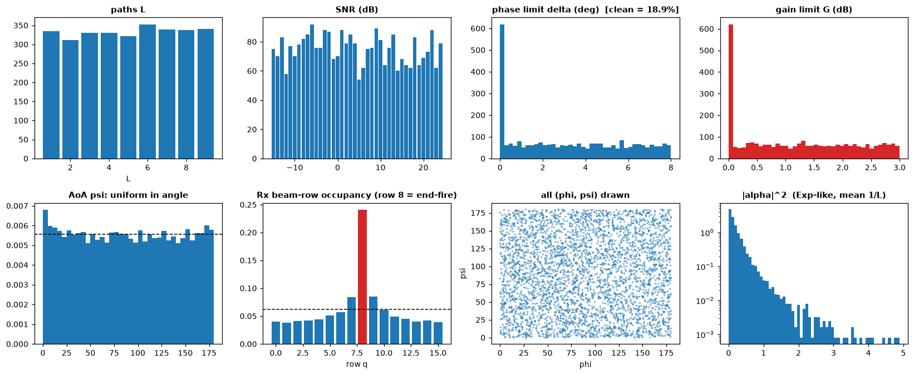

**Point at:** top row = L, SNR, phase limit, gain limit. Bottom row = AoA histogram, beam-row occupancy, all angle pairs, path power.

**Say:**
- "This is a sample of scenes drawn with the real training recipe."
- "Top row: L is uniform from 1 to 9. SNR is uniform from minus 15 to 24. About 20 percent of scenes have zero impairment, that is the tall bar at zero. The rest are uniform up to 8 degrees and 3 dB."
- "Bottom row: angles are uniform in angle (left and third plot). But look at the second plot: the *beam row* occupancy is not uniform. The red bar is row 8, the end-fire row. About 22 to 24 percent of all paths fall there, versus 6.25 percent if it were uniform. This is the cosine effect I mentioned: the arcsine law."
- "Last plot: path power is exponential-like, as expected from Rayleigh gains. Many weak paths, a few strong ones."

---

## Slide 15 - One sample of every training case  (`S15_training_cases.png`)

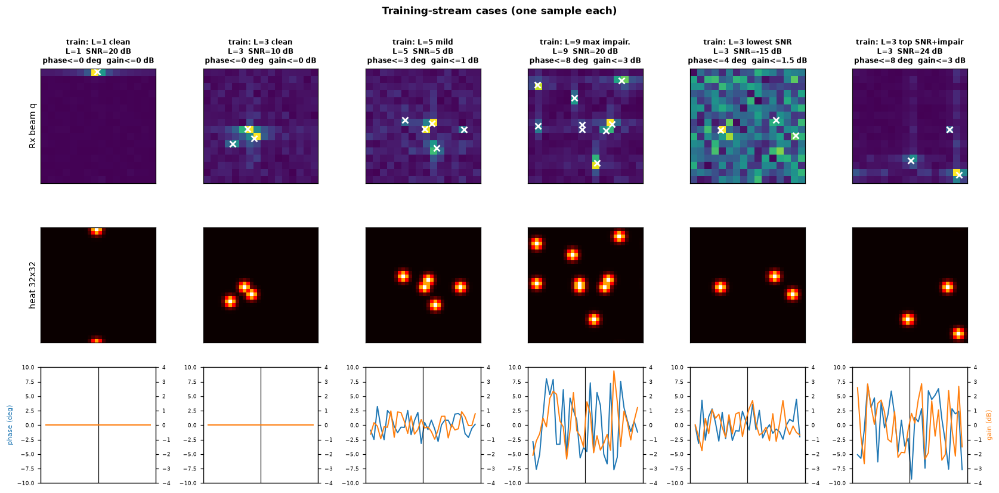

**Point at:** columns left to right; for each, top = Y, middle = heatmap, bottom = impairment label.

**Say:**
- "One example for each kind of training case: L=1 clean, L=3 clean, L=9 with maximum impairment, L=3 at the lowest SNR (-15 dB), and L=3 at top SNR (24 dB) with impairment."
- "With L equals 1 you see a single peak. With L equals 9 there are many overlapping peaks and some blobs in the heatmap come close together."
- "At minus 15 dB the input looks almost like noise, but the label is still clean blobs. That gap is what the network learns to close."
- "The bottom row shows the impairment label. Flat for the clean cases, larger and noisier for the impaired ones."

---

## Slide 16 - One sample of every test case  (`S16_test_cases.png`)

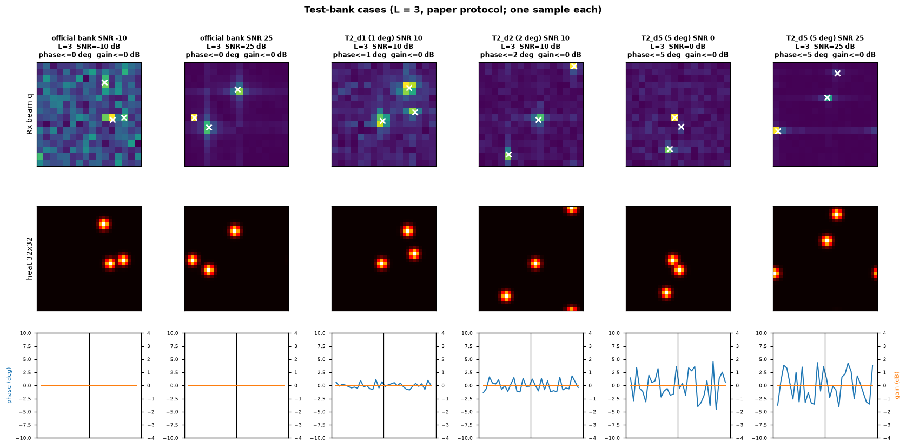

**Point at:** official bank at SNR -10 and 25; T2 banks with 1, 2, 5 degrees.

**Say:**
- "These are the test-bank settings, one example each: official bank at SNR -10 and 25; T2 banks with 1, 2 and 5 degrees of phase error. L is always 3. The official bank has no impairment. The T2 banks have phase-only impairment."
- "At 1 and 2 degrees the picture is close to clean. The 5 degree bank is where the impairment matters most."
- "In the test banks the gain error is zero, exactly like the paper. The gain error is only used in our own stress tests."

---

## Slide 17 - Test banks table (no image, or put this table on a slide)

| Bank | Size | L | SNR (dB) | Hardware error | Seed |
|---|---|---|---|---|---|
| official (`eval_bank.npz`) | 8,000 | 3 | -10 to 25, step 5 (1,000 each) | none | 42 |
| dldoa test | 8,000 | 3 | same | none | 7 |
| T2_d1 / d2 / d5 | 8,000 each | 3 | same | phase only, 1 / 2 / 5 deg | 9101 / 9102 / 9105 |
| tuning banks | about 1,500 total | mixed | mixed | mixed | 9901 to 9904 |
| v1 robustness | 47 banks x 500 | 3 | various | phase / gain / SNR sweeps | various |
| **training** | **12,288,000 fresh scenes** | 1 to 9 | -15 to 24 | 20% none, else up to 8 deg and 3 dB | OS entropy |

**Say:**
- "The official bank is reproduced bit-exactly from the authors' generator with seed 42. A second independent draw with seed 7 is also bit-exact."
- "Tuning banks are separate from the final test banks. We tune the self-calibration parameters only on the tuning banks."
- "We never train on test scenes, and we never tune on test scenes."

---

## Slide 18 - Checks we ran (text slide)

**Say:** "We verified the generator with automatic checks, all of them pass:"
- Codebooks are unitary (error about 1e-15).
- Y equals FFT2 of H divided by 16 for ideal hardware (error about 1e-14).
- H has rank equal to the number of paths.
- Realised SNR matches the nominal SNR (10.01 dB measured for 10 dB nominal over 3,000 scenes).
- Phase error stays within the limit. Gain error stays within the limit.
- Impairment label has zero mean and zero slope.
- Heatmap peak is exactly 1 and stays in [0, 1].
- At very high SNR, the strongest bin of Y is within one cell of a true path in all tested scenes.
- Angle sampler and both codebooks are identical to the authors' file `dldoa_dataset_generation.py`.

---

## Slide 19 - Honest limitations (text slide, important - say these before someone asks)

1. **Gain error is our extension.** The two cited papers do not model gain error. The uniform-in-dB, 3 dB range is our assumption.
2. **Impairment is redrawn for every scene and is the same for all beams.** The authors' code does the same, even though it is described as "static". Real phase shifters may depend on the beam.
3. **Two paths can be too close to separate on the beam grid.** In L equals 3 scenes, about 3.9 percent have two paths within one beam cell (wrap-aware). About 0.35 percent of scenes have two paths that land on the *same* 32 by 32 label cell.
4. **End-fire crowding.** 22 to 24 percent of paths fall in the single end-fire row (3.6 to 3.9 times the uniform share), caused by the cosine mapping.
5. **Phase-ramp ambiguity.** A linear phase ramp across the array looks like an angle shift, so a small fraction of cases cannot be recovered by any method. The exact fraction depends on how you count: about 1 to 3 percent per axis at 5 degrees in our audit. That is why the label removes the ramp.
6. **The number of paths L is given to the method** (oracle L). This follows the base paper's protocol but limits absolute claims.
7. **Paper text and code differ.** Paper: SNR -10 to 25, L 1 to 10. Code we use: SNR -15 to 24, L 1 to 9. The pi/6 separation is stated in code.
8. **Training data is not exactly repeatable** because of OS entropy in the seed. All test banks are repeatable.

---

## Quick numbers cheat-sheet (memorise these)

| Item | Value |
|---|---|
| Array | 16 Tx antennas, 16 Rx antennas, half-wavelength ULA |
| Measurement | Y is 16 x 16 complex, Y = W^H H F + Z |
| Channel scale | sqrt(Nt x Nr) = 16 |
| Path gain | alpha ~ CN(0, 1/L), sorted strongest first |
| Angle range | uniform on [0, 180 deg]^2, min distance pi/6 = 30 deg |
| Noise | each part std = sqrt(10^(-SNR/10) / 2) |
| Impairment | D = g e^{j eps}; eps uniform +-delta; gain uniform +-G dB in dB |
| Heatmap | 32 x 32, Gaussian sigma = 1 cell, wrap-around, max over paths, peak = 1 |
| Impairment label | 32 x 2 (16 Rx + 16 Tx; phase, log-gain), mean and ramp removed |
| Training | L 1..9, SNR -15..24, 20% clean, delta <= 8 deg, G <= 3 dB, batch 256, 48,000 steps |
| Total training scenes | 12,288,000, each used once, none stored |
| Test | L = 3, SNR -10..25 step 5, 1,000 each, 8,000 per bank |
| Test seeds | 42 (official), 7 (dldoa), 9101 / 9102 / 9105 (T2), 9901 to 9904 (tuning) |

---

## Likely questions and short answers

**Q: Why not just store a dataset?**
A: A simulator can make unlimited new scenes, so the network never sees the same scene twice and cannot memorise. Test sets are stored so results are reproducible.

**Q: How do you know the simulator is correct?**
A: It reproduces the authors' generator bit-exactly for the official bank (seed 42) and a second test set (seed 7). Also the maths checks: unitary codebooks, FFT identity, correct SNR.

**Q: Why a 32 by 32 heatmap and not 16 by 16?**
A: To locate a path between beams. Twice the resolution gives finer angle estimates.

**Q: Why remove the phase ramp from the impairment label?**
A: A linear ramp across the array is the same as an angle shift. Data cannot tell them apart, so asking for it would be asking for the impossible.

**Q: Is noise added before or after the beams?**
A: After the receive combiner, one independent complex Gaussian per entry of Y.

**Q: Why does end-fire get so many paths?**
A: Angles are uniform, but beam position depends on cosine of the angle. Cosine changes slowly near 0 and 180 degrees, so many angles map to almost the same beam.

**Q: Do you train on test scenes?**
A: No. Training seeds come from operating-system entropy. Test seeds are fixed. Tuning uses separate tuning banks.

**Q: Where is the gain error from?**
A: It is our own extension for robustness. The papers only model phase error.

**Q: What does the network get as input and what must it output?**
A: Input: Y as 2 x 16 x 16 (real, imaginary). Outputs: the 32 x 32 heatmap and the 32 x 2 impairment vector.
